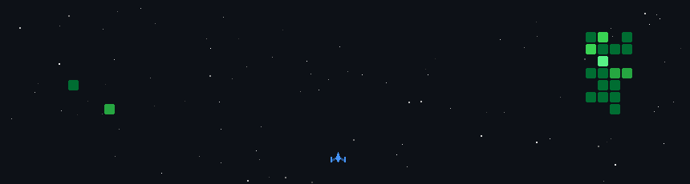

<div align="center">



</div>

<p align="center"></p>

<p align="center"></p>

## `01` — ABOUT

<p align="center"></p>

## `02` — WHAT I BUILD

<p align="center"></p>

## `03` — ENGINEERING STYLE

<p align="center"></p>

## `04` — TECH ENVIRONMENT

<p align="center">


</p>

<p align="center"></p>

## `05` — GITHUB ACTIVITY

<p align="center"></p>

<p align="center">
  
</p>

<p align="center">
  
</p>

## `06` — CONNECT

<p align="center"></p>

<div align="center">

```text
$ echo "Let's build something."

GitHub :: github.com/dimitridey2004
```

</div>

## `07` — SPACE CONTRIBUTION GAME 🚀

<p align="center">
  
</p>

<p align="center">
  <sub>Every contribution becomes an enemy. Every commit adds fuel. Keep coding. Keep shooting. 🚀</sub>
</p>

<p align="center"></p>
